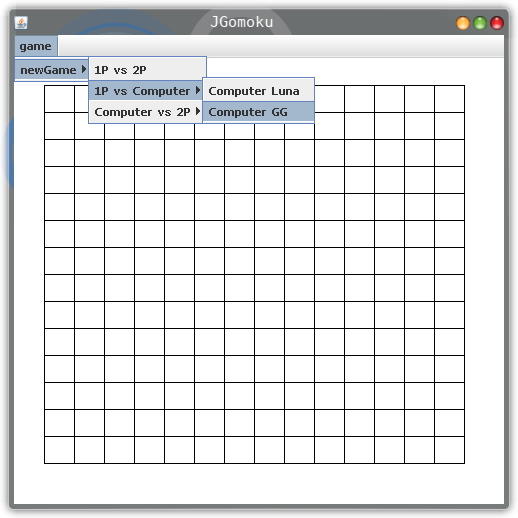
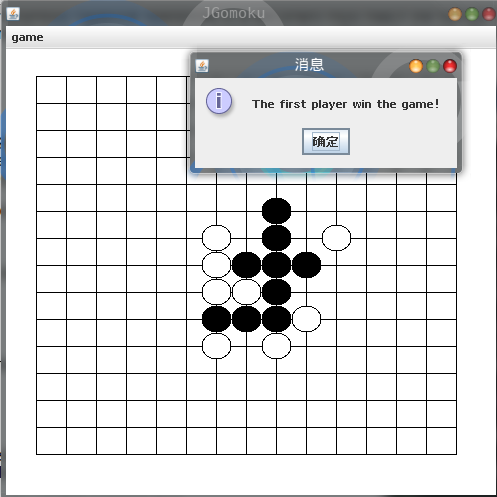
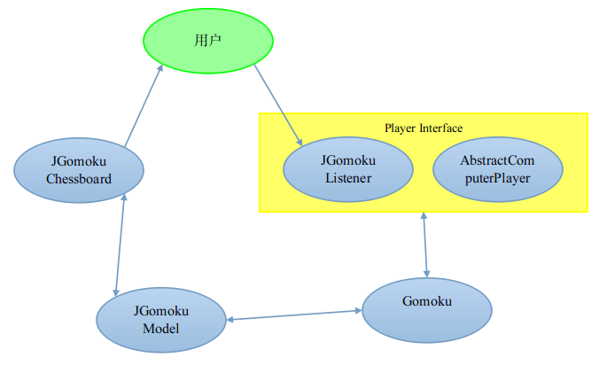
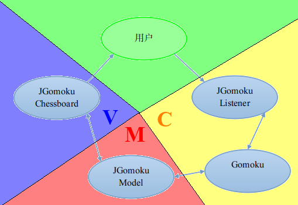

===============
JGomoku工程文档
===============

总体概述
========

功能概述
--------

JGomoku是一个五子棋程序，可以实现人人对战、人机对战的功能。
JGomoku中共计实现了2个不同的AI，两个AI采用了不同的算法，
在最终的速度以及行为上均有一定差别。两个AI均可以达到一个相对合理的智能水平，
可以和人类进行简单的对战，其智能基本和一个刚开始玩五子棋的玩家相当。

软件平台说明
------------

开发平台

+ 操作系统：Gentoo Linux (Kernel 3.15.10-e)

+ Java：

  Java(TM) SE Runtime Environment (build 1.8.0_25-b17)

  Java HotSpot(TM) 64-Bit Server VM (build 25.25-b02, mixed mode)

+ Apache Ant(TM)： 1.9.1

+ Eclipse：4.2.1-r1

运行平台

+ Java>=1.8.0

+ 编译依赖Apache Ant(TM)

软件构建说明
------------

软件使用了Java技术并采用Ant进行构建(Build)，因此，构建时依赖Java以及Ant。

构建需要将工作目录切换到含有build.xml的目录下，并执行ant::

  cd JGomoku
  ant

默认的构建脚本将会自动 **构建** 并 **执行** JGomoku。
ant的输出大致如下::

  Buildfile: /home/wlm/projects/jgomoku/build.xml

  clean:

  compile:
    [mkdir] Created dir: /home/wlm/projects/jgomoku/build/classes
    [javac] /home/wlm/projects/jgomoku/build.xml:14: warning:
    'includeantruntime' was not set, defaulting to build.sysclass
    path=last; set to false for repeatable builds
    [javac] Compiling 15 source files to /home/wlm/projects/
    jgomoku/build/classes

  exec:

  BUILD SUCCESSFUL
  Total time: 3 seconds

其中，执行exec阶段时会自动弹出JGomoku的图形化界面。

软件功能概述
============

界面概述
--------

软件的图形界面具有一个菜单，目前菜单仅设计了一个功能，即开始一场新游戏(new game)。
可以选择如下三类选项：

+ 1P vs 2P

  此选项为人人对战，两个玩家均为人类玩家。

+ 1P vs Computer

  此选项为人机对战，人类玩家执黑先行。电脑玩家执白。

+ Computer vs 2P

  此选项为人机对战，电脑玩家执黑先行，人类玩家执白。

其中，人机对战选项均为子菜单，子菜单中可以选择与两个不同的AI之一进行对战。
AI具体情况如下：

+ ComputerLuna

  这个AI是一个运行速度较快的AI，采用直接估值的方法实现。

+ ComputerGG

  这个AI采用了不同的算法，运行较慢，会预测对手下一步的行动。
  随着棋局的复杂化，行动会越来越慢。

   菜单截图

软件使用流程
------------

选择开始一局新游戏，并在棋盘中进行对战。当一方胜利时，会弹出对话框。按确定后游戏结束。之后棋盘锁定，直到选择用户在菜单中选择开始新游戏为止。

   运行截图

软件设计说明
============

概览
-----

JGomoku的基本架构如下图所示，基本上采用了MVC设计模式的思想。棋盘显示完全放置在JChessBoard类中实现。所有棋盘相关的数据均储存在JGomokuChessboardModel中。其余部分则控制了游戏的逻辑。

   JGomoku总体架构图

Player接口设计说明
------------------

Player接口用于定义玩家和游戏控制逻辑(Gomoku类)的交互规则。
作为玩家需要支持以下几个方法::

    public abstract void active(boolean isFirstPlayer);
    public abstract void addPlayerActionEventListener(
            PlayerActionEventListener listener);
    public abstract void removePlayerActionEventListener(
            PlayerActionEventListener listener);
    public abstract JGomokuChessboardModel getModel();
    public abstract void setModel(JGomokuChessboardModel model);
    public void end(boolean isPlayerWin);

各个方法的用途如下

+ active方法

  这一方法用于通知玩家游戏已经开始，参数isFirstPlayer用于告知玩家其是先手还是后手。

+ end方法

  这一方法用于通知玩家游戏已经结束，参数isPlayerWin用于告知玩家其是否获胜。
  这是为了后续添加具有学习功能的AI而设计的。但目前的AI由于未能实现学习功能，
  所以没有用到这一参数。

+ add/removePlayerActionEventListener方法

  玩家所下的棋子的位置被封装成了PlayerActionEvent这一自定义事件。
  而这一对方法正是用于添加或删除这一事件的监听器的方法。任何玩家(包括电脑玩家)
  下一颗子的行为在JGomoku的设计中均被封装成事件，游戏控制逻辑通过事件监听来
  获得玩家的走子，并驱动游戏进程不断继续。

+ get/setModel方法

  这一对方法用于获取/设置玩家当前所面对的棋局(棋局信息储存在一个Model中)。

Gomoku类设计说明
------------------

Gomoku负责控制游戏进程。实现包括开始游戏，结束游戏，监听玩家输入的功能。
调用Gomoku类的start方法可以开始一局游戏。这个方法需要传入两个实现了
Player接口的实例，分别代表执黑和执白的玩家。Gomoku会负责初始化当前的Model
并开始监听Player的相关动作。Gomoku会根据玩家下棋的动作，修改Model的数据，
并根据Model中当前棋局是否有五子成一条线这一状态信息，判断是否应当结束游戏。

当然，目前Gomoku还存在一些问题。在当前的实现中，Gomoku不会判断玩家的行动
是否合法。如果玩家下在了一个已经有棋子的位置，Gomoku不会报出任何错误。这是
由于当前Model的设计局限造成的，暂时未想到较好的解决方案。

Gomoku的存在使得人人对战、人机对战，乃至要实现机机对战都十分容易，只需要传入
任意的两个实现了Player接口的实例，即可开始一次游戏。假设后续要对网络对战进行
支持，也不必修改当前Gomoku的设计。仅需传入一个实现了Player接口的通过网络获取
输入的类即可。

综上，Gomoku的设计基本上是合理且具有可扩展性的。

JGomokuChessBoard相关设计说明
-----------------------------

JGomokuChessBoard相关的类和接口较多，模仿了swing标准控件的MVC设计模式。
总共包含了2个接口和3个类。其MVC结构图如下

   JGomoku MVC结构图

与传统的MVC结构不同，这个MVC结构针对当前的应用做了修改。作为View的
JGommokuChessBoard类与Controller部分基本无关联，而选择通过直接监测Model
的变化来重绘当前棋盘的状态。Controller部分也只修改Model，不直接控制View的显示。
这样做虽然与标准的MVC模式不相符，但在当前需求下是简洁且可行的一种方案。可扩展性
上也能满足要求。

JGomokuChessBoardListener和JGomokuModel均为接口，真正的实现类是
BasicJGomokuChessboardListener和DefaultJGomokuChessboardModel。
这样做是仿照了Java的Swing中控件的实现。Swing中所有控件的MVC三个部分均有接口
和一组默认实现。这样做扩展性更强，以后可能更容易被别的代码使用。所以在
JGomoku项目中，我模仿了这一设计，设计了两个接口和对应的默认实现。由于时间有限，
View部分的类并没有抽象出接口。

AI设计说明
----------

AbstractComputerPlayer设计说明
~~~~~~~~~~~~~~~~~~~~~~~~~~~~~~

所有AI均继承自AbstractComputerPlayer这个基类。这个基类实现了Player接口，
负责处理所有AI均需处理的共同功能。而其子类仅需要实现AIAction()这个函数即可。
AIAction()函数返回一个坐标，代表AI要下的棋子的位置。

为不阻塞GUI进程，AI采用了多线程设计。当active()方法被调用时，AI将单独开启一个
线程并立即返回。在这个新线程中，AIAction()函数将被调用，以计算下一步具体应该
下的位置。

所有事件处理，增减监听器等操作均在基类中完成，使得子类只需要专注于AI的实现即可。

AbstractComputerPlayer类主要逻辑如下::

  abstract class AbstractComputerPlayer implements Player,Runnable{

    public void active(boolean isFirstPlayer)
    {
        this.isFirstPlayer=isFirstPlayer;
        Thread t=new Thread(this,"Computer");
        t.start();
    }
    public void run() {
        Point result=AIAction(this.isFirstPlayer?
                              GomokuGlobal.black():
                              GomokuGlobal.white());
        firePlayerAction(new PlayerActionEvent(this,result));
    }

    protected void firePlayerAction(PlayerActionEvent event);
    public void addPlayerActionEventListener(
            PlayerActionEventListener listener);
    public void removePlayerActionEventListener(
            PlayerActionEventListener listener);
    protected abstract Point AIAction(int currentPlayer);
  }

ComputerLuna设计说明
~~~~~~~~~~~~~~~~~~~~

ComputerLuna会枚举所有可能下的位置，并对下在这些位置后的局面进行估价。
ComputerAction的AIAction主要为一个二重循环，用于枚举所有可能的位置并
求出对应的估价，示意代码如下::

    protected Point AIAction(int currentPlayer) {

        if (getModel().isEmpty()) {
            return new Point(8,8);
        }

        for (i = 1; i <= 15; i++) {
            for (j = 1; j <= 15; j++) {
                if (getModel().getChessboardState(i, j) == 0) {
                    cx = i;
                    cy = j;
                    compute();
                    double value = computeValue(x);
                    if (value > maxValue) {
                        maxValue = value;
                        ret.setX(i);
                        ret.setY(j);
                    }
                }
            }
        }

        return ret;
    }

上述代码首先特判了先手的情况。如果先手则直接下在棋盘中心的位置。如果不是先手
则枚举所有当前棋盘上的空位，并计算下在该空位后棋局的估价。找到估价最好的位置作为
AI的输出。

估价方法为搜索连成1、2、3、4、5个子的数量乘以对应权重。
活1、死1、活2、死2、活3、死3等权重为5的升幂排列。如果AI有一个则总估分增加对应权重。
如果对方有一个则总估分减少一定权重。

估分函数大致如下::

    static final int[] w={1,5,25,125,625,3125,
                          15625,0xfffffff,0xfffffff,0xfffffff,
                          -25,-125,-625,-3125,-15625,-78125,
                          -390625,-0xfffff,-0xfffff,-0xfffff};

    private double computeValue(int[][] _x) {
        double value = 0;
        int i, j;
        for (i = 0; i < 2; i++) {
            for (j = 0; j < 10; j++) {
                if (i + 1 == currentPlayer) {
                    value += w[j] * _x[ i ][ j + 1];
                } else {
                    value += w[j + 10] * _x[i][ j + 1];
                }
            }
        }
        value += w[20];
        return value;
    }

上述代码中的_x为双方连成的活1、死1、活2、死2、活3、死3等情况的数量。w的权重在
设置时，使得对手的权重远高于我方权重，否则AI会出现只顾自己进攻，而完全不去防御对方
进攻的情况。同时，通过权重调节使得当我方有机会连成活四或五个时不再关注对方的进攻，
而是优先连成活四或五以保证自己的胜利。避免出现连成四个却去拦对手的活三之类的情况。

ComputerGG设计说明
~~~~~~~~~~~~~~~~~~

ComputerGG在算法设计上仍有一些缺陷，限于时间和能力，最终仍未能完全解决。所以命名
为GG，以表明这是一个未完全完成的(或者说是挂掉的)AI。GG采用了博弈的极大极小搜索，
会预测对手下一步的行动。GG假设对手会采用使当前局面估价最低的行动(因为估价越高对
GG越有利)，而GG会搜索每一个可行的位置，判断在当前位置下，无论对手怎样行动，己方价值
最高的点。

ComputerGG的估价算法和ComputerLuna的估价算法原理基本一致。之前还尝试过采用最长
连成的子数作为估价函数，但效果极差，在尝试了各种改进之后，最终还是选择了和Luna
相仿的算法估价。

由于GG的AI算法在实现和优化上做得有不到位的地方，且算法本身的时间复杂度较高，
因此GG的反应较为缓慢。一般需要等待数秒才能给出结果。

文档说明
=========

本文档相关技术说明
------------------

本文档采用ReStructuredText编写而成。通过Docutils工具转换为xelatex文档，
进而生成了PDF版本。

工程目录下的rst文件为本文档的源文件。docutils.conf为配置文件，docutils.tex
文件为本文档的模版。
